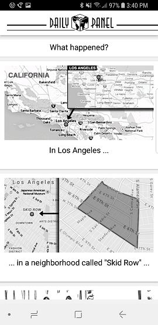
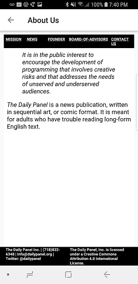

# Daily Panel Android App

## Synopsis

Name:   Daily Panel Android App

This is a project that turns website http://dailypanel.org/ into a user-friendly Android application. 

The goal of this app is to help and dignify those who are learning to read English. 
The app is designed to be as simple and easy-to-use as possible, so the user can focus  on what matters most, learning to read English.

 <kbd></kbd>

## Code Description

The key functions of the Daily Panel App are:
 1. JSON feeds which pull individual panels and titles from the Daily Panel website into the Main Activity.
 2. Text-To-Speech to capture the titles.
 3. About Us Activity page with WebViews to capture screen information on the website.

Below are screen shots:

 <kbd></kbd>
 

 <kbd></kbd>
 

 <kbd></kbd>

 

## Motivation

Application was a group project for the "Grow with Google Challenge Scholarship: Android Basics" course on Udacity.

## Installation

Project can be downloaded from GitHub:  https://github.com/ciscosoriano/daily-panel-app

## API Reference

## Tests (Future consideration!)

Describe and show how to run the tests with code examples.

## Contributors

The following group members designed and developed this project:
Francisco Soriano - Hailey Mortimore - Lakshmi Mahes - Lindsey Giuliano - Allene Barrett - Claudia Hill

## License

Only to be used for educational purposes.
